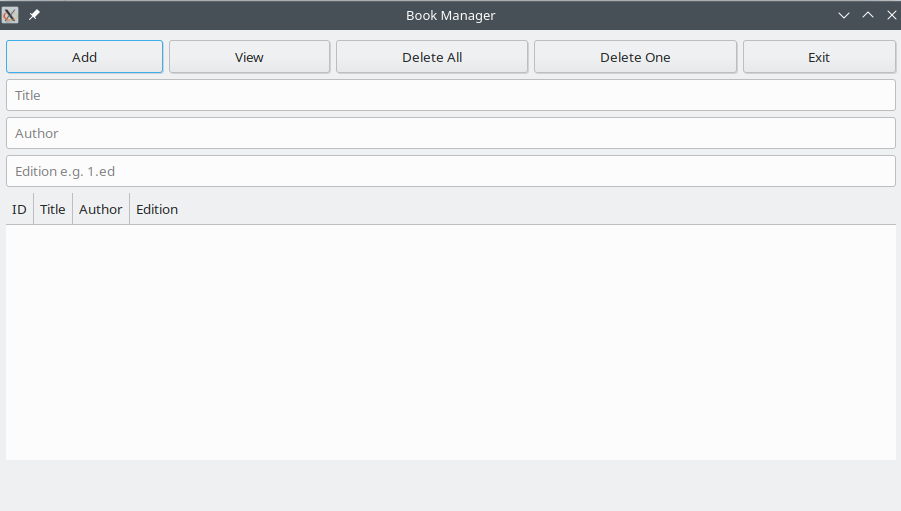
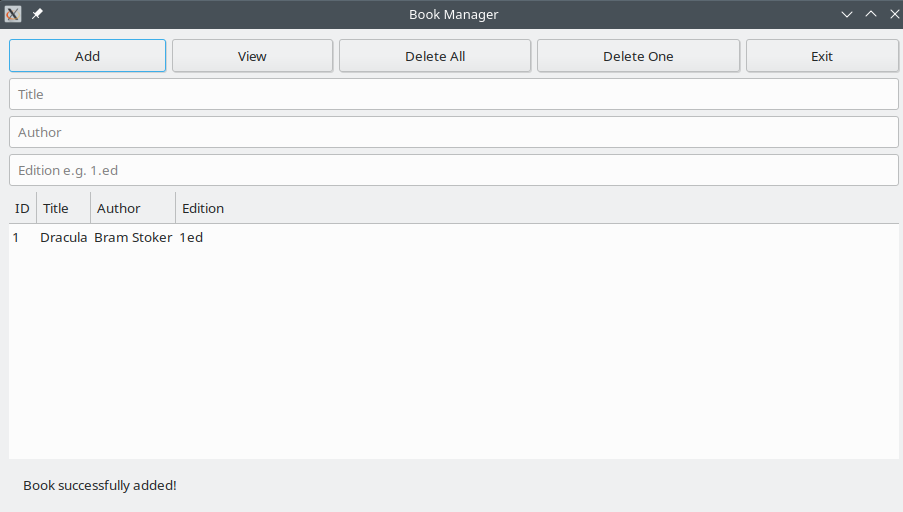

# Book-Manager
A book cataloger program

## ABOUT

This is a second version of the program Book Manager. A C program with GTK interface for for storing books data like title, author and edition.

## Screenshots





## Installation

### Manual Installation

Clone the repository and navigate into the project directory, build and install:

```bash
git clone https://github.com/profmatjr/Book-Manager2.git
cd Book-Manager2
make
sudo make install

```

That's it!!!


